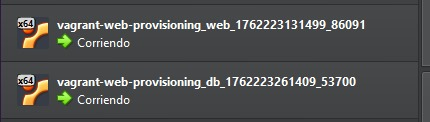
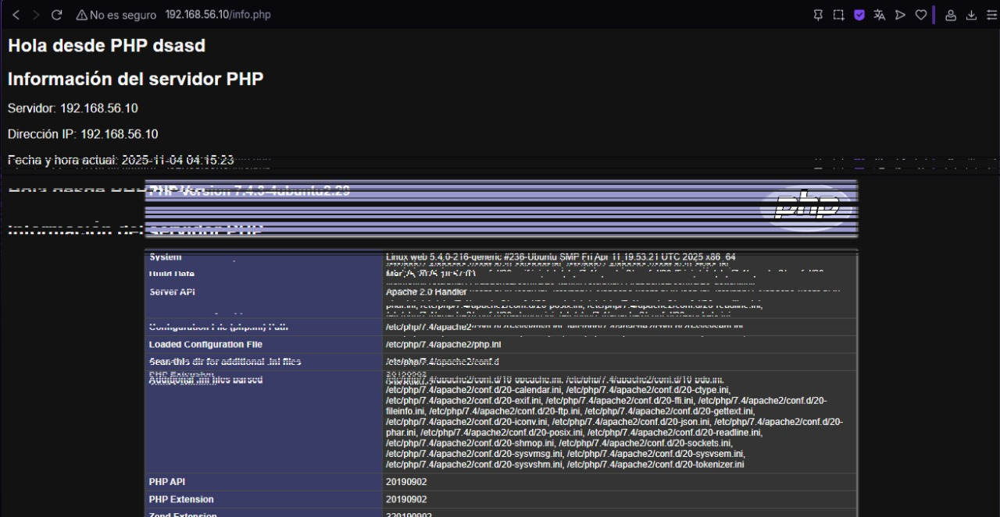
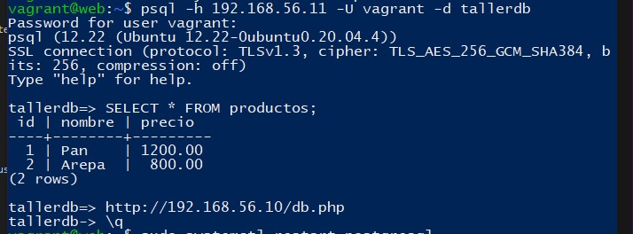
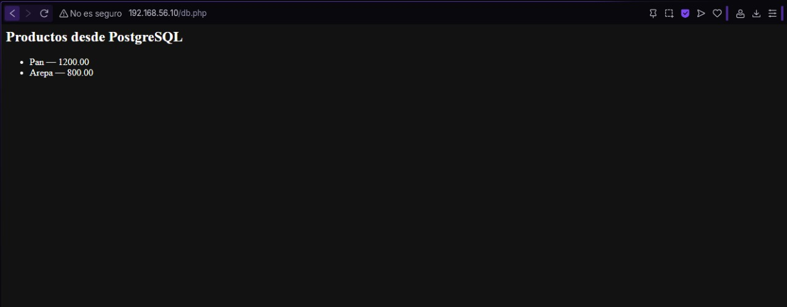

# Taller Vagrant + Provisionamiento con Shell

## Pasos
1. Clonar este repositorio.
2. Ejecutar `vagrant up` para levantar las máquinas.
3. Acceder a la máquina web en: http://192.168.56.10
4. Verificar `index.html` y `info.php`.

## Reto
- Completar `provision-db.sh` para instalar PostgreSQL.
- Crear una base de datos y tabla.
- Conectar la página PHP a la base de datos y mostrar datos.

# Documentación de la resolución del taller

## Primera parte: configuración inicial del entorno

Para empezar, hice fork del repositorio proporcionado y luego lo clone en mi disco duro con git clone para asi obtener el `Vagrantfile`. Este archivo lo modifique y definí las dos máquinas necesarias:

* `web` con IP `192.168.56.10`
* `db` con IP `192.168.56.11`

Ambas se configuraron como red privada para que pudieran comunicarse entre sí sin exponer servicios al exterior.

El bloque del `Vagrantfile` quedó así:

```ruby
Vagrant.configure("2") do |config|
  config.vm.define "web" do |web|
    web.vm.box = "ubuntu/focal64"
    web.vm.network "private_network", ip: "192.168.56.10"
    web.vm.provision "shell", path: "provision-web.sh"
  end

  config.vm.define "db" do |db|
    db.vm.box = "ubuntu/focal64"
    db.vm.network "private_network", ip: "192.168.56.11"
    db.vm.provision "shell", path: "provision-db.sh"
  end
end
```

Después de definir esto, ejecuté `vagrant up` para crear las máquinas en VirtualBox.
En este punto fue útil verificar que las IPs respondieran con un `ping` y que se pudiera ingresar por `vagrant ssh web` y `vagrant ssh db`.



---

## Configuración de la máquina web

En la máquina **web** instalé Apache y PHP.
Lo hice manualmente , y después me plantee quizas dejarlo así, pero no lo cambie por que no tenia tiempo de hacer comprobaciones:

```bash
#!/usr/bin/env bash
set -e

apt-get update -y
apt-get install -y apache2 php libapache2-mod-php php-pgsql

cp -r /vagrant/www/* /var/www/html/
chown -R www-data:www-data /var/www/html/

systemctl enable apache2
systemctl restart apache2

echo "Provisionamiento web completado."
```

Este script instala todo lo necesario para servir las páginas PHP y habilita el módulo `php-pgsql`, que permite conectarse a PostgreSQL.
Una vez ejecutado, comprobé que Apache estuviera activo con `systemctl status apache2` y abrí en el navegador `http://192.168.56.10/`.
El archivo `index.html` cargó correctamente y `info.php` mostró la configuración de PHP.

!¨[index](./capturas/archivo_index.jpg)

---

## Configuración de la máquina db

En la máquina **db** configuré PostgreSQL mediante el archivo `provision-db.sh`.
El objetivo era instalar la base de datos, crear un usuario, una base de datos y una tabla con algunos datos iniciales.

El script quedó así:

```bash
#!/usr/bin/env bash
set -e

export DEBIAN_FRONTEND=noninteractive
apt-get update -y
apt-get install -y postgresql postgresql-contrib

PGUSER="vagrant"
PGPASS="vagrant"
PGDB="tallerdb"

sudo -u postgres psql -tc "SELECT 1 FROM pg_roles WHERE rolname='${PGUSER}'" | grep -q 1 || sudo -u postgres psql -c "CREATE USER ${PGUSER} WITH PASSWORD '${PGPASS}';"
sudo -u postgres psql -tc "SELECT 1 FROM pg_database WHERE datname='${PGDB}'" | grep -q 1 || sudo -u postgres psql -c "CREATE DATABASE ${PGDB} OWNER ${PGUSER};"

sudo -u postgres psql -d ${PGDB} <<SQL
CREATE TABLE IF NOT EXISTS productos (
  id SERIAL PRIMARY KEY,
  nombre VARCHAR(100),
  precio NUMERIC(10,2)
);
INSERT INTO productos (nombre, precio)
  SELECT 'Pan', 1200.00 WHERE NOT EXISTS (SELECT 1 FROM productos WHERE nombre='Pan');
INSERT INTO productos (nombre, precio)
  SELECT 'Arepa', 800.00 WHERE NOT EXISTS (SELECT 1 FROM productos WHERE nombre='Arepa');
SQL

PG_VER=$(psql -V | awk '{print $3}' | cut -d'.' -f1,2)
PG_CONF="/etc/postgresql/${PG_VER}/main/postgresql.conf"
PG_HBA="/etc/postgresql/${PG_VER}/main/pg_hba.conf"

sed -i "s/#listen_addresses = 'localhost'/listen_addresses = '*'/g" "${PG_CONF}"
echo "host    all             all             192.168.56.0/24            md5" >> "${PG_HBA}"

systemctl restart postgresql
```

Este script deja PostgreSQL listo para aceptar conexiones desde la red privada y con los datos precargados.

Después de ejecutar `vagrant provision db`, verifiqué que el servicio estuviera activo (`systemctl status postgresql@<versión>-main`) y comprobé que la tabla se hubiera creado:

```bash
sudo -u postgres psql -d tallerdb -c "SELECT * FROM productos;"
```



---

## Reto: conexión entre PHP y PostgreSQL

La parte más importante del reto era lograr que la máquina **web** se conectara con la **db** para consultar los productos desde un archivo PHP.

En la carpeta `www` creé el archivo `db.php` con el siguiente contenido:

```php
<?php
$host = '192.168.56.11';
$port = '5432';
$dbname = 'tallerdb';
$user = 'vagrant';
$password = 'vagrant';

$conn_string = "host=$host port=$port dbname=$dbname user=$user password=$password";
$dbconn = pg_connect($conn_string);

if (!$dbconn) {
    echo "<p>Error conectando a la BD</p>";
    exit;
}

$result = pg_query($dbconn, "SELECT id, nombre, precio FROM productos");
if (!$result) {
    echo "<p>Error en consulta</p>";
    exit;
}

echo "<h2>Productos desde PostgreSQL</h2><ul>";
while ($row = pg_fetch_assoc($result)) {
    echo "<li>" . htmlspecialchars($row['nombre']) . " — " . htmlspecialchars($row['precio']) . "</li>";
}
echo "</ul>";
pg_close($dbconn);
?>
```

Antes de que funcionara correctamente, tuve que resolver varios errores.
Primero, al ejecutar el script, aparecía un mensaje en los logs de Apache:
`Call to undefined function pg_connect()`.
Eso indicaba que el módulo `php-pgsql` no estaba instalado, así que lo solucioné con:

```bash
sudo apt-get install -y php-pgsql
sudo systemctl restart apache2
```

Después, probé desde la máquina web con `psql -h 192.168.56.11 -U vagrant -d tallerdb` para confirmar que podía acceder remotamente a la base.
Tuve que ajustar `postgresql.conf` y `pg_hba.conf` en la máquina db para permitir conexiones desde `192.168.56.0/24` y reiniciar el servicio.

Una vez hecho esto, el archivo `db.php` cargó correctamente en el navegador y mostró los productos con sus precios.



---


